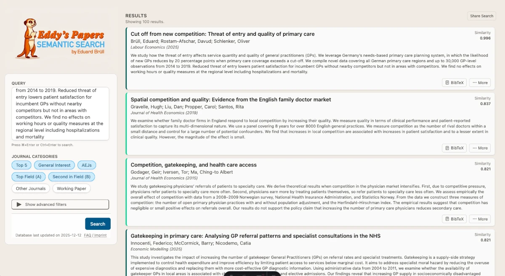

# Eddy's Papers 


A **Semantic Paper Search Engine** for economics papers from the [RePEc](https://repec.org) archives. Uses vector embeddings of Abstracts to enable natural language queries over academic publications.

## Overview

This project provides:
- Automated synchronization with RePEc archives via rsync
- RDF/ReDIF metadata parsing using Perl backend
- Semantic embeddings generation with Ollama (mxbai-embed-large model)
- Vector similarity search using DuckDB with VSS extension
- REST API built with R Plumber
- Modern web interface built with Astro and React

It also ships a second, agentic product — **Agentic Search** (a.k.a. "Detective mode") — a
multi-turn assistant that turns a plain-language research brief into a tailored literature review.
It writes and runs R queries against the same DuckDB in a hardened sandbox, streams its reasoning
live, and synthesises the result. See [Agentic Search](#agentic-search) below.

A third product, **EconPeople**, makes the *person* the unit of search instead of the paper:
find economists by topic, joined from the RePEc Author Service archive onto the same corpus. See
[EconPeople](#econpeople) below.

## Project Structure

```text
eddyspaperui/
├── backend/                 # R package for data pipeline and API
│   ├── R/                   # Package source code
│   │   ├── config.R         # Configuration utilities
│   │   ├── folders.R        # Folder reference factory
│   │   ├── sync.R           # RePEc rsync synchronization
│   │   ├── parse.R          # RDF parsing with Perl
│   │   ├── embed.R          # Embedding generation
│   │   ├── database.R       # DuckDB operations
│   │   └── api.R            # API endpoint functions
│   ├── inst/plumber/        # Plumber API definition
│   │   └── api.R
│   ├── DESCRIPTION          # Package metadata
│   └── NAMESPACE            # Exported functions
├── frontend/                # Astro + React web interface
│   ├── src/
│   │   ├── components/      # React UI components
│   │   ├── layouts/         # Astro layouts
│   │   ├── lib/             # API client
│   │   └── pages/           # Astro pages
│   └── package.json
├── agentic/                 # Agentic Search ("Detective mode") — second product
│   ├── agentic_backend/     # Hono + TypeScript service (SSE pipeline, R sandbox, DuckDB cache)
│   ├── agentic_frontend/    # Astro + React chat-style UI
│   ├── r/                   # eddysearch.sandbox R package (the verbs the agent calls)
│   └── 00–07_*.md           # Canonical design docs (architecture, prompts, roadmap, features)
├── econpeople/              # EconPeople (person finder): design docs + assets
│   └── 00–03_*.md           # Vision, data model, API surface, profile tiers
├── econpeople_frontend/     # EconPeople Astro + React web interface
├── data/                    # Data storage (not in repo)
│   ├── RePEc/               # Downloaded archives
│   ├── rds_archivep/        # Parsed RDF data
│   ├── db/                  # DuckDB database
│   └── journals.csv         # Journal metadata
├── run_api.R                # Start production API server
└── update_repec.R           # Update pipeline for cron jobs
```

## Features

### Backend
- **Sync**: Download and update RePEc paper archives
- **Parse**: Extract metadata from ReDIF format files
- **Embed**: Generate semantic embeddings using local Ollama instance
- **Search**: Vector similarity search with filters (year, journal, category)
- **API Endpoints**:
  - `/search`: Semantic search with multiple filters
  - `/save`: Save search queries and results
  - `/saved/:hash`: Retrieve saved searches
  - `/stats/journals`: Journal statistics
  - `/stats/categories`: Category distribution
  - `/stats/total`: Total article count
  - `/stats/last_updated`: Last database update timestamp

### Frontend
- **Two-phase UI**: Landing view transitions to sidebar layout on search
- **Semantic search**: Natural language paper queries
- **Category filtering**: Journal and Series Categories (Top 5, General Intereset, Top Field, Second in Field, Other, Working Paper Series)
- **Year filtering**: Filter by minimum publication year
- **BibTeX export**: One-click citation copying
- **Expandable abstracts**: Toggle paper abstract visibility
- **Extended Infromation on Citations/References:** Additional information in results cards

## Agentic Search

**Agentic Search** ("Detective mode") is a second product that lives alongside the semantic search.
Instead of ranking abstracts by vector similarity, it takes a natural-language brief, writes a
tailored R script against the same DuckDB, runs it in a hardened sandbox, and synthesises a
literature review — streaming each step to the browser as it happens.

It is modelled on a literature-search workflow but productised to run server-side with no
filesystem assumptions. The backend is **Hono + TypeScript** (not R); the frontend is **Astro +
React**. The existing R Plumber API and search UI are untouched and keep running at their current
URLs.

### Pipeline

A request streams over Server-Sent Events through a typed event protocol:

```
clarify → write → validate → execute → synthesize
```

- **clarify** — judges whether the brief is specific enough; can reject off-topic briefs.
- **write** — an LLM writes an R script using only the allow-listed `eddysearch.sandbox` verbs.
- **validate** — the script is AST/SQL-checked before it is allowed to run.
- **execute** — the script runs in a sandbox against a read-only copy of the DuckDB and emits
  papers/sections as structured events.
- **synthesize** — an LLM writes the final review over the returned papers; only this step streams
  tokens.

### Optional features (per-run toggles)

- **Blocking clarifier** — when enabled, the agent pauses and asks one Claude-Code-style question
  (multiple-choice chips plus a free-text box) before searching; the answer is folded into the
  script. A "Skip clarifying questions" toggle runs straight through.
- **Refine strategy (multi-stage)** — when enabled, after the first results an assessor advises one
  corrective or broadening pass (e.g. widen the window, expand via citations), then synthesis runs
  once over the accumulated set. Off by default — zero added cost.

### Exports & access

- **Exports** — a finished review can be downloaded as **PDF** (browser print-to-PDF over the
  rendered review + sources), **Excel** (`.xlsx`, server-rendered from the collected sources),
  **BibTeX**, and evidence-rich **Markdown** (the review followed by a `Sources` section with
  one field row per paper: authors, year, title, journal, abstract).
- **Access gate** — setting `AGENTIC_PASSWORD` puts the costly LLM routes behind a single shared
  password (a login screen in the UI; `Authorization: Bearer` on the API). Leave it unset for
  open local dev. The SSE result stream stays open — run IDs are unguessable.

### How it relates to the main backend

- Reads the **same** `articles.duckdb` (read-only copy) plus the existing `cit_*`, `handle_stats`,
  `journals`, `version_links`, and `bib_coupling` tables — no new tables required.
- Reuses existing REST endpoints (`/search`, `/handlestats`, `/versions`, `/cites`, `/citedby`) as
  fallbacks; the sandbox reads the DB directly for the hot path.
- A small DuckDB file under `agentic/agentic_backend/data/agentic/` is a disposable cache of search
  runs — safe to delete.

### Run the agentic services

```bash
# Backend (Hono + TS) — listens on http://127.0.0.1:8001
cd agentic/agentic_backend
npm install
# Create a .env with at least:
#   OPENROUTER_API_KEY=...        # LLM access via OpenRouter
#   MODEL_WRITER=... MODEL_CLARIFIER=... MODEL_ASSESSOR=... MODEL_SYNTH=...
#   SEMANTIC_API_BASE=...         # the R Plumber API base (fallback lookups)
#   EDDYPAPERS_API_KEY=...        # key for that API (never reaches the browser)
#   AGENTIC_PASSWORD=...          # optional: shared password gating the costly LLM
#                                 #   routes (leave unset to disable the gate in dev)
npm run dev

# Frontend (Astro + React)
cd agentic/agentic_frontend
npm install
npm run dev
```

Design decisions are canonical in the numbered docs under `agentic/` (`00_overview.md` →
`07_multistage.md`).

## EconPeople

**EconPeople** (branding: the "Diogenes meerkat") is a third product whose unit of search is the
**person** rather than the paper. It finds economists by topic or natural-language query ("who
works on monetary policy in commodity-exporting economies?"). It is built on the RePEc Author
Service (`pers`) archive of ~88k registered authors, ingested into the **same** DuckDB and joined
to the existing corpus on `handle`, so each author's papers, citations and impact stats are
*joined in* from tables already maintained (no data duplicated, no name disambiguation for
registered authors).

### Two-stage overlap retrieval

The headline capability does **not** average each author into a single vector (that would blend an
author's separate research lines together). Instead:

1. Run a large *hidden* paper-level semantic search (the existing base-eddyspapers vector search).
2. Roll the matched papers up to their authors via `person_works` and rank authors by weighted
   overlap.

An author's automation papers surface them for "automation" and their democracy papers for
"democracy" (same person, no blending), and the matched papers are returned as **evidence** for
why each author ranked.

### Architecture & endpoints

Per design decision **D-3**, EconPeople ships **API-first**: the person endpoints **extend the
existing R/Plumber `eddyspapersbackend`** (shared DuckDB, maximum infra reuse) rather than a new
service. It adds the person tables `persons`, `person_works`, `person_stats`, `person_wikidata`
alongside the existing ones. A separate Astro + React frontend lives in `econpeople_frontend/`.

- `POST /person/search`: topic to ranked authors with matched-paper evidence (the headline).
- `GET /person/{short_id}`: author profile.
- `GET /person/{short_id}/papers`: full expandable publication list.
- `GET /person/lookup?name=...`: name search / autocomplete.
- `GET /person/stats/searches`, `GET /person/dailylogs`: admin telemetry (mirrors the
  paper-search logging machinery).

The person verbs are also exposed inside **Agentic Search** (`person_search`, `person_lookup`,
`person_profile`, `person_papers`), so a brief can target people as well as papers.

Design decisions are canonical in the numbered docs under `econpeople/` (`00_overview.md` →
`03_profile_tiers.md`).

## Requirements

### System Dependencies
- **R** (≥4.0.0)
- **Perl** with ReDIF-perl modules for parsing
- **Ollama** with mxbai-embed-large model for embeddings
- **rsync** for RePEc synchronization
- **Node.js** (≥18) for frontend development

### R Package Dependencies
- tidyverse, here, fs
- DuckDB, pool, DBI
- tidyllm (Ollama integration)
- plumber (REST API)
- rprojroot, withr, arrow, jsonlite

## Setup

### 1. Install Backend Package

```r
# Install backend package
devtools::install("backend/")
```

### 2. Configure Folders

Create `data/` directory structure:
```bash
mkdir -p data/{RePEc,rds_archivep,pqt,pqt_diff,db}
```

Add `data/journals.csv` with journal metadata.

### 3. Install Ollama Model

```bash
ollama pull mxbai-embed-large
```

### 4. Initial Data Pipeline

```r
# Run complete update pipeline
source("update_repec.R")
```

This will:
- Sync RePEc archives
- Parse RDF files
- Generate embeddings
- Populate DuckDB database
- Create search indices

### 5. Start API Server

```r
# Start Plumber API on port 8000
source("run_api.R")
```

### 6. Start Frontend

```bash
cd frontend
npm install
npm run dev
```

## Usage

### Production API
```r
source("run_api.R")
```


### Development
```bash
# Terminal 1: Start API
Rscript run_api.R

# Terminal 2: Start frontend dev server
cd frontend && npm run dev
```

## API Examples

### Search Papers
```bash
curl -X POST http://localhost:8000/search \
  -H "Content-Type: application/json" \

  -d '{
    "query": "Reductions in Gouvernment Expenditures and Political Polarization",
    "min_year": 2020,
    "limit": 10
  }'
```

## Architecture

### Data Flow
1. **Sync**: rsync downloads RePEc archives to `data/RePEc/`
2. **Parse**: Perl processes RDF files → R data frames → RDS files
3. **Embed**: tidyllm generates embeddings via Ollama
4. **Store**: DuckDB stores papers + embeddings with VSS extension
5. **Search**: Plumber API provides vector similarity search
6. **Display**: Astro/React frontend queries API and renders results


## License

MIT License

## Contact

Eduard Brüll
eduard.bruell@zew.de
